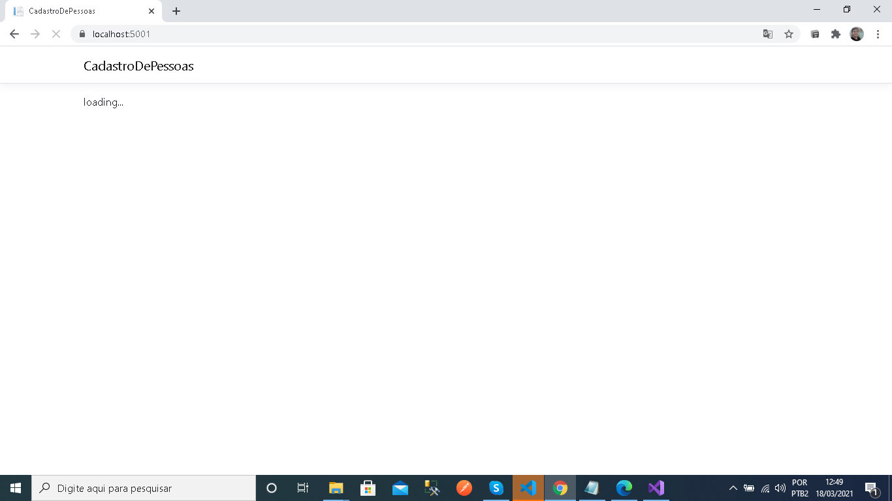
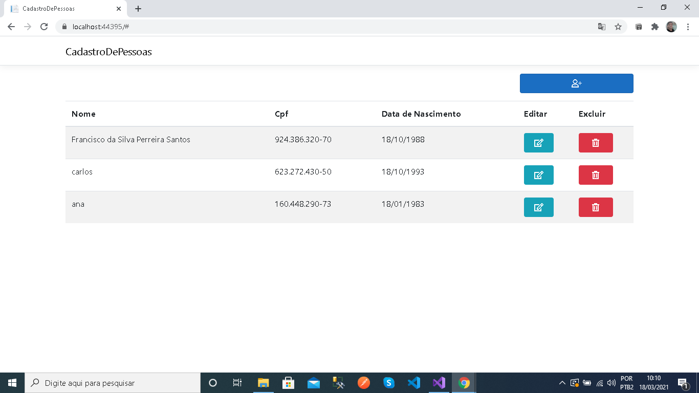
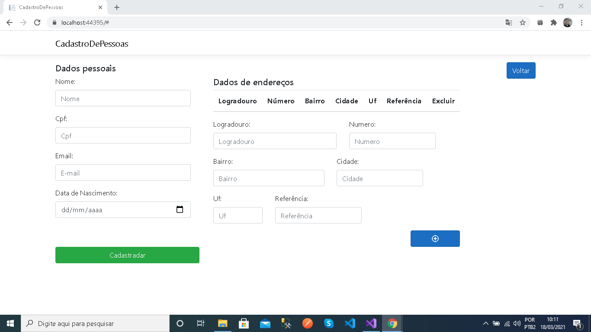
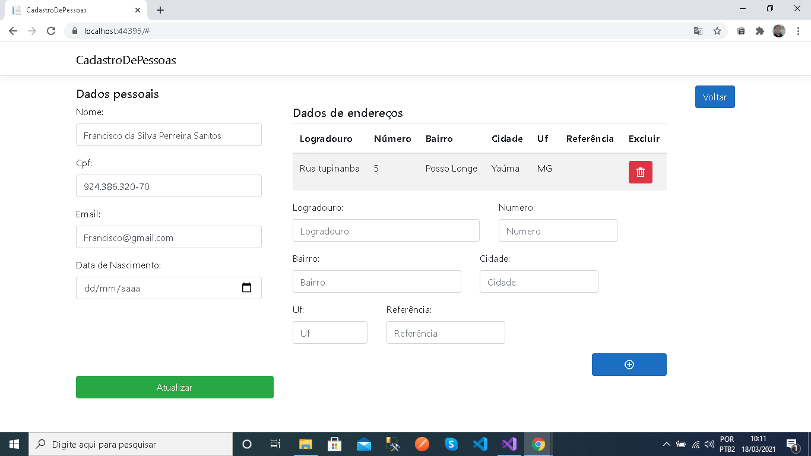

# CadastroDePessoas
* Projeto desenvolvido com .net core, reactjs e entity framework core.
* Objetivo: implementar uma aplicação de CRUD    
* Conhecimentos utilizados: POO, SOLID, Clean Architecture (Backend) e Conceitos de Componentização (Frontend).

## Arquitetura
    O projeto está dividido em três camadas sendo cada uma um projeto diferente.
    As camadas são:
    Cadastro de Pessoa
    Domain
    Infrastructure

    Cadastro de pessoa é uma aplicação Aspnet core MVC, que retorna como views uma aplicação reactjs e fornece os contrellers (endpoint) do projeto.

    Domain é uma biblioteca de classe a qual usei para separar os models e regras de négocio (tais como validações) da camada de aplicação.

    Infrastructure essa camada também é uma biblioteca de classes e nela separei as responsabilidade acesso a banco de dados.

## Estrutura camada Cadastro de Pessoa
<pre>
/
    ClientApp/ (Diretório da aplicação React)
                Public/ (Diretório de arquivos estáticos)
                src/
                    Components (Componentes do frontend)
                    Repositories (Conjuntos de chamadas aos controllers)
    Controllers/ (Conjuntos de endpoints do projeto.)
</pre>

## Estrutura camada Domain
<pre>
/
    Models/ (Diretório das entidades da aplicação.)
    Validations/ (Diretório das validações das regras de négocio.)
</pre>

## Estrutura camada Infrastructure
<pre>
/
    Contexts/ (Diretório de contextos do entity.)
    Migrations/ (Diretório das migrações do banco.)
    Repositories/ (Diretório das chamadas de acesso ao banco.)
</pre>

## Testando o projeto
    Após clonar o repositório sugiro que execute os seguintes passos:
    
    1- 
        1.1 abra o projeto no Visua Studio, caso não lembre-se de usar dotnet restore para restaura as dependências do projeto.
        1.2 Na camada de Infrastructure execute as migrations para o entity cria o banco local.
    
    2- compile cada projeto individualmente antes de rodar a aplicação.
    
    3- Rode o projeto, prefiro subir ele com Kestrel por se mais rápido que o IIS Express, para isso, via linha de comando vou até a raiz do projeto CadastroDePesso e executo dotnet run
    
    4- Com o servidor levantado vou até o navegador e digito https://localhost:5001/

5- O servidor reponderar com a tela de loading :

obs: no primeiro carregamento devido a inicialização do Banco ela ficará mais tempo expost.

6- Após pegar os dados do BD a tela de home aprecerá:

7- Ao clicar no botão azul escuro a tela de cadastro criar será aberta:

8- Já se clicar no botão de Editar a tela de edição será aberta:

## Melhorias:
* Implementar paginação tanto no front como no back, para melhorar a vizualização de cadastros na home.
* Implementar busca por nome/cpf de cadastros na home.